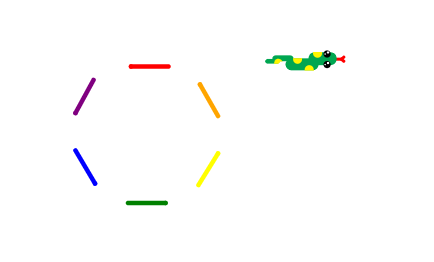

# WIP
Please note that this is still being actively developed, hence may not work properly for you!

# IPythonDisplayTurtle
An implementation of the classic turtle module mainly implemented using IPython.display, IPython.HTML, and paperscript. 
Can be used with Jupyter Notebooks, and in places where ipywidgets are not supported. Only requires one way communication to work, so great for remote server cases.

How to install from a terminal/command prompt:
	pip install IPythonDisplayTurtle
	
To install from a jupyter notebook cell:
	!pip install IPythonDisplayTurtle

How to use:
```python
from IPythonDisplayTurtle import Snake

colours=["red","orange","yellow","green","blue","purple"]
divisions = 12
angle = 360/divisions 

t = Snake(_pendown = 0)
for i in range(divisions):
    if(i%2 == 0):
        t.pendown()
        t.pencolor(colours[int(i/2)%len(colours)])
    else:
        t.penup()
    t.goforward(300/divisions)
    t.turnright(angle)
t.penup()
t.goforward(120)
t.turnright(360)

t.display()
```



[](https://mybinder.org/v2/gh/atahan-git/IPythonDisplayTurtle/master)